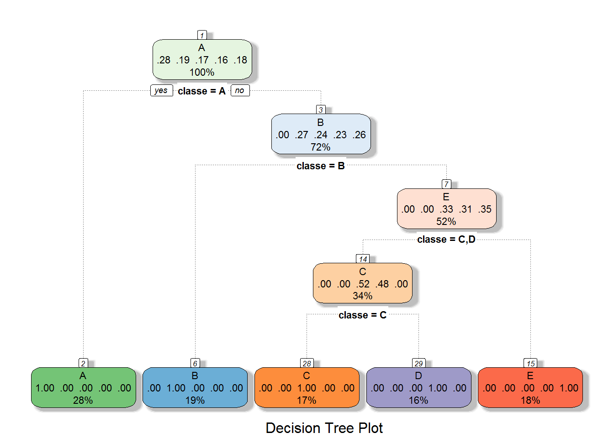

# Weight Lifting - Barbell lifts classification
Asmi Ariv  
July 2, 2016  


## Executive Summary

This paper deals with the analysis of the data from accelerometers on the belt, forearm, arm, and dumbell of 6 participants. They were asked to perform barbell lifts correctly and incorrectly in 5 different ways. The objective of this project is to come up with a predictive model using machine learning algorithm in order to predict the manner in which these particpants did the exercise.

Original source of data: <http://groupware.les.inf.puc-rio.br/har>

There are five classes: A, B, C, D, and E. A corresponds to the specified execution of the exercise while other classes correspond to common mistakes.

After running various models, cross validation and out of sample error analysis was found to be that decision tree and random forest performed exteremely well while boosting did not perform so well. However, for testing datasets (with 20 cases), random forest was the winner with 95% accuracy.


##Data preparation
Loading required packages

```r
require(caret)
require(rpart)
require(randomForest)
require(gbm)
library(RColorBrewer)
require(MASS)
require(rattle)
```

Loading the data

```r
training <- read.csv("pml-training.csv", na.strings=c("NA","#DIV/0!",""))
testing <- read.csv("pml-testing.csv", na.strings=c("NA","#DIV/0!",""))
sum(!is.na(intersect(colnames(training),colnames(testing)))) #To check if both training and test datasets have the same columns.
```

```
## [1] 159
```


```r
str(training, list.len=c(14))
```

```
## 'data.frame':	19622 obs. of  160 variables:
##  $ X                       : int  1 2 3 4 5 6 7 8 9 10 ...
##  $ user_name               : Factor w/ 6 levels "adelmo","carlitos",..: 2 2 2 2 2 2 2 2 2 2 ...
##  $ raw_timestamp_part_1    : int  1323084231 1323084231 1323084231 1323084232 1323084232 1323084232 1323084232 1323084232 1323084232 1323084232 ...
##  $ raw_timestamp_part_2    : int  788290 808298 820366 120339 196328 304277 368296 440390 484323 484434 ...
##  $ cvtd_timestamp          : Factor w/ 20 levels "02/12/2011 13:32",..: 9 9 9 9 9 9 9 9 9 9 ...
##  $ new_window              : Factor w/ 2 levels "no","yes": 1 1 1 1 1 1 1 1 1 1 ...
##  $ num_window              : int  11 11 11 12 12 12 12 12 12 12 ...
##  $ roll_belt               : num  1.41 1.41 1.42 1.48 1.48 1.45 1.42 1.42 1.43 1.45 ...
##  $ pitch_belt              : num  8.07 8.07 8.07 8.05 8.07 8.06 8.09 8.13 8.16 8.17 ...
##  $ yaw_belt                : num  -94.4 -94.4 -94.4 -94.4 -94.4 -94.4 -94.4 -94.4 -94.4 -94.4 ...
##  $ total_accel_belt        : int  3 3 3 3 3 3 3 3 3 3 ...
##  $ kurtosis_roll_belt      : num  NA NA NA NA NA NA NA NA NA NA ...
##  $ kurtosis_picth_belt     : num  NA NA NA NA NA NA NA NA NA NA ...
##  $ kurtosis_yaw_belt       : logi  NA NA NA NA NA NA ...
##   [list output truncated]
```
*Here the output has been truncated for space constraints*


The training dataset contains 19622 observations and 160 variables. The variable "classe" is the output variable with five classes: A, B, C, D and E. 

Testing and training datasets have 159 identical columns which means all columns are same as the classe variable is not included in testing data.

Looking at the data, we see that there are many variables with mostly NAs, and
hence we need to exclude them as they may not be useful in our classification
model building. Therefore, we need to develop a function that will return 
FALSE for all the columns having more than 50% NAs and TRUE for all those columns
which have less than 50% NAs.

##Feature selection


```r
remove <- function(x=data.frame(), t=0.5){
  len = dim(x)[2]
  r <- c()
      for (i in 1:len){
        if(mean(is.na(x[,i]))>t)r[i] = FALSE
        else r[i] = TRUE

      }
  r
}

newdataIndex <- remove(training)
newdata <- training[,newdataIndex]

dim(training)
```

```
## [1] 19622   160
```

```r
dim(newdata)
```

```
## [1] 19622    60
```

```r
mean(is.na(newdata))
```

```
## [1] 0
```

And we see that a substantial number of columns has been excluded from the 
dataset with no missing values now.

We'll also remove the first 7 variables as they aren't important for predictions:

```r
newTraining <- newdata[,-c(1:7)]

dim(newTraining)
```

```
## [1] 19622    53
```

We need to check for the near zero varience:


```r
near_zero_var <- nearZeroVar(newTraining, saveMetrics=TRUE)

near_zero_var
```

```
##                      freqRatio percentUnique zeroVar   nzv
## roll_belt             1.101904     6.7781062   FALSE FALSE
## pitch_belt            1.036082     9.3772296   FALSE FALSE
##  [ reached getOption("max.print") -- omitted 51 rows ]
```
*Here the output has been truncated for space constraints*

And there are no variables with non-variability.

##Data slicing for cross validation

Now, we split the newTraining data into test and train datasets for our model 
building, however, in order to come up with the best model we will divide the dataset into three groups each containing a separate pair of train-test datasets.
This will have two fold benefit: more option to try out different model
and perform cross validation on multiple datasets.


```r
set.seed(33)
index1 <- createDataPartition(y=newTraining$classe, p=0.33, list=F)
data1 <- newTraining[index1,]
heldout<- newTraining[-index1,]

set.seed(33)
index2 <- createDataPartition(y=heldout$classe, p=0.50, list=F)
data2 <- heldout[index2,]
data3<- heldout[-index2,]

set.seed(33)
inTrain1 <- createDataPartition(y=data1$classe, p=0.6, list=F)
train1 <- data1[inTrain1,]
test1<- data1[-inTrain1,]

set.seed(33)
inTrain2 <- createDataPartition(y=data2$classe, p=0.6, list=F)
train2 <- data2[inTrain2,]
test2<- data2[-inTrain2,]

set.seed(33)
inTrain3 <- createDataPartition(y=data3$classe, p=0.6, list=F)
train3 <- data3[inTrain3,]
test3<- data3[-inTrain3,]
```

#Model selection

Now, let's begin with the model selection process with different permutations 
and combinations using three pairs of train-test datasets.

We will apply three models and see which one performs the best:

Running the boosting model on first train set with 5000 iterative trees:

```r
set.seed(11)
boostFit1 <- gbm(classe ~ ., data=train1, n.tree=5000,distribution="multinomial")
```

Running the decision tree with standardized data and cross validation method on second train set:

```r
set.seed(11)
dtreeFit1 <- train(train2, train2$classe,
                 method = "rpart",
                 preProcess = c("center", "scale"),
                 tuneLength = 10, 
                 trControl = trainControl(method = "cv"))

print(dtreeFit1, digits=3)
```

```
## CART 
## 
## 3946 samples
##   53 predictor
##    5 classes: 'A', 'B', 'C', 'D', 'E' 
## 
## Pre-processing: centered (52), scaled (52), ignore (1) 
## Resampling: Cross-Validated (10 fold) 
## Summary of sample sizes: 3551, 3551, 3549, 3552, 3553, 3551, ... 
## Resampling results across tuning parameters:
## 
##   cp      Accuracy  Kappa
##   0.0000  1.000     1.000
##   0.0301  1.000     1.000
##   0.0601  1.000     1.000
##   0.0902  1.000     1.000
##   0.1202  1.000     1.000
##   0.1503  1.000     1.000
##   0.1804  1.000     1.000
##   0.2104  1.000     1.000
##   0.2405  0.836     0.792
##   0.2705  0.381     0.165
## 
## Accuracy was used to select the optimal model using  the largest value.
## The final value used for the model was cp = 0.21.
```

```r
print(dtreeFit1$finalModel, digits=3)
```

```
## n= 3946 
## 
## node), split, n, loss, yval, (yprob)
##       * denotes terminal node
## 
##  1) root 3946 2820 A (0.28 0.19 0.17 0.16 0.18)  
##    2) classe=A 1122    0 A (1 0 0 0 0) *
##    3) classe=B,C,D,E 2824 2060 B (0 0.27 0.24 0.23 0.26)  
##      6) classe=B 764    0 B (0 1 0 0 0) *
##      7) classe=C,D,E 2060 1340 E (0 0 0.33 0.31 0.35)  
##       14) classe=C,D 1335  647 C (0 0 0.52 0.48 0)  
##         28) classe=C 688    0 C (0 0 1 0 0) *
##         29) classe=D 647    0 D (0 0 0 1 0) *
##       15) classe=E 725    0 E (0 0 0 0 1) *
```
Plotting the decision tree based on using fancyRpartPlot() function from rattle package (as described in Machine Learning Course):

```r
fancyRpartPlot(dtreeFit1$finalModel, sub="Decision Tree Plot")
```

<!-- -->

Running random forest on third train set:

```r
set.seed(11)
ranforFit1 <- randomForest(classe~., data=train3)
```


#Cross Validation
Now let's predict the classification for the respective test sets:

```r
predict1 <- predict(boostFit1, newdata=test1, n.trees=5000, type="response")
pred_class <- apply(predict1, 1, which.max)
pred_class <- factor(pred_class, labels=c("A","B","C","D","E"))
print(confusionMatrix(pred_class, test1$classe), digits=4)
```

```
## Confusion Matrix and Statistics
## 
##           Reference
## Prediction   A   B   C   D   E
##          A 608  91  44  35  18
##          B  29 297  28  15  71
##          C  30  73 352  47  35
##          D  60  33  27 300  30
##          E   9   7   1  27 322
## 
## Overall Statistics
##                                           
##                Accuracy : 0.7258          
##                  95% CI : (0.7081, 0.7429)
##     No Information Rate : 0.2843          
##     P-Value [Acc > NIR] : < 2.2e-16       
##                                           
##                   Kappa : 0.6524          
##  Mcnemar's Test P-Value : < 2.2e-16       
## 
## Statistics by Class:
## 
##                      Class: A Class: B Class: C Class: D Class: E
## Sensitivity            0.8261   0.5928   0.7788   0.7075   0.6765
## Specificity            0.8985   0.9315   0.9134   0.9307   0.9792
## Pos Pred Value         0.7638   0.6750   0.6555   0.6667   0.8798
## Neg Pred Value         0.9286   0.9051   0.9513   0.9420   0.9307
## Prevalence             0.2843   0.1935   0.1746   0.1638   0.1839
## Detection Rate         0.2348   0.1147   0.1360   0.1159   0.1244
## Detection Prevalence   0.3075   0.1699   0.2074   0.1738   0.1414
## Balanced Accuracy      0.8623   0.7622   0.8461   0.8191   0.8278
```

```r
predict2 <- predict(dtreeFit1, newdata=test2)
print(confusionMatrix(predict2, test2$classe), digits=4)
```

```
## Confusion Matrix and Statistics
## 
##           Reference
## Prediction   A   B   C   D   E
##          A 747   0   0   0   0
##          B   0 508   0   0   0
##          C   0   0 458   0   0
##          D   0   0   0 430   0
##          E   0   0   0   0 483
## 
## Overall Statistics
##                                      
##                Accuracy : 1          
##                  95% CI : (0.9986, 1)
##     No Information Rate : 0.2845     
##     P-Value [Acc > NIR] : < 2.2e-16  
##                                      
##                   Kappa : 1          
##  Mcnemar's Test P-Value : NA         
## 
## Statistics by Class:
## 
##                      Class: A Class: B Class: C Class: D Class: E
## Sensitivity            1.0000   1.0000   1.0000   1.0000   1.0000
## Specificity            1.0000   1.0000   1.0000   1.0000   1.0000
## Pos Pred Value         1.0000   1.0000   1.0000   1.0000   1.0000
## Neg Pred Value         1.0000   1.0000   1.0000   1.0000   1.0000
## Prevalence             0.2845   0.1935   0.1744   0.1637   0.1839
## Detection Rate         0.2845   0.1935   0.1744   0.1637   0.1839
## Detection Prevalence   0.2845   0.1935   0.1744   0.1637   0.1839
## Balanced Accuracy      1.0000   1.0000   1.0000   1.0000   1.0000
```

```r
predict3 <- predict(ranforFit1, newdata=test2)
print(confusionMatrix(predict3, test3$classe), digits=4)
```

```
## Confusion Matrix and Statistics
## 
##           Reference
## Prediction   A   B   C   D   E
##          A 740  18   0   0   0
##          B   4 481  17   0   1
##          C   3   8 438  20   1
##          D   0   1   3 409   4
##          E   0   0   0   1 477
## 
## Overall Statistics
##                                           
##                Accuracy : 0.9692          
##                  95% CI : (0.9618, 0.9754)
##     No Information Rate : 0.2845          
##     P-Value [Acc > NIR] : < 2.2e-16       
##                                           
##                   Kappa : 0.961           
##  Mcnemar's Test P-Value : NA              
## 
## Statistics by Class:
## 
##                      Class: A Class: B Class: C Class: D Class: E
## Sensitivity            0.9906   0.9469   0.9563   0.9512   0.9876
## Specificity            0.9904   0.9896   0.9852   0.9964   0.9995
## Pos Pred Value         0.9763   0.9563   0.9319   0.9808   0.9979
## Neg Pred Value         0.9963   0.9873   0.9907   0.9905   0.9972
## Prevalence             0.2845   0.1935   0.1744   0.1637   0.1839
## Detection Rate         0.2818   0.1832   0.1668   0.1558   0.1816
## Detection Prevalence   0.2887   0.1915   0.1790   0.1588   0.1820
## Balanced Accuracy      0.9905   0.9682   0.9708   0.9738   0.9936
```


#Conclusion

After running various models, cross validation and accuracy level test it was found:

* Decision tree with standardized data and cross validation method performed extremely well with accuracy of 100%

* Random Forest perfomed quite well too with the accuracy level 96.7%

* Boosting with 5000 iterative trees has not performed so well with only 72.5% of accuracy 


##Model performance on Testing dataset

The random forest model was used to predict the outcome of testing dataset, which showed 95% accuracy.


```r
testingindex <- remove(testing)
testingnew <- testing[testingindex]
testingnew <- testingnew[,-c(1:7)]
predict_testing <- predict(ranforFit1, newdata=testingnew)
```

#Results

The final model that was used to predict the testing dataset with 20 cases was random forest, which succesfully predicted the outcomes with 95% accuracy. Although decision tree did perform exteremely well with 100% accuracy, it performed poorely on testing data (20 cases), which is a clear sign of overfitting. No wonder, random forest is one of the best algorithms by far.


